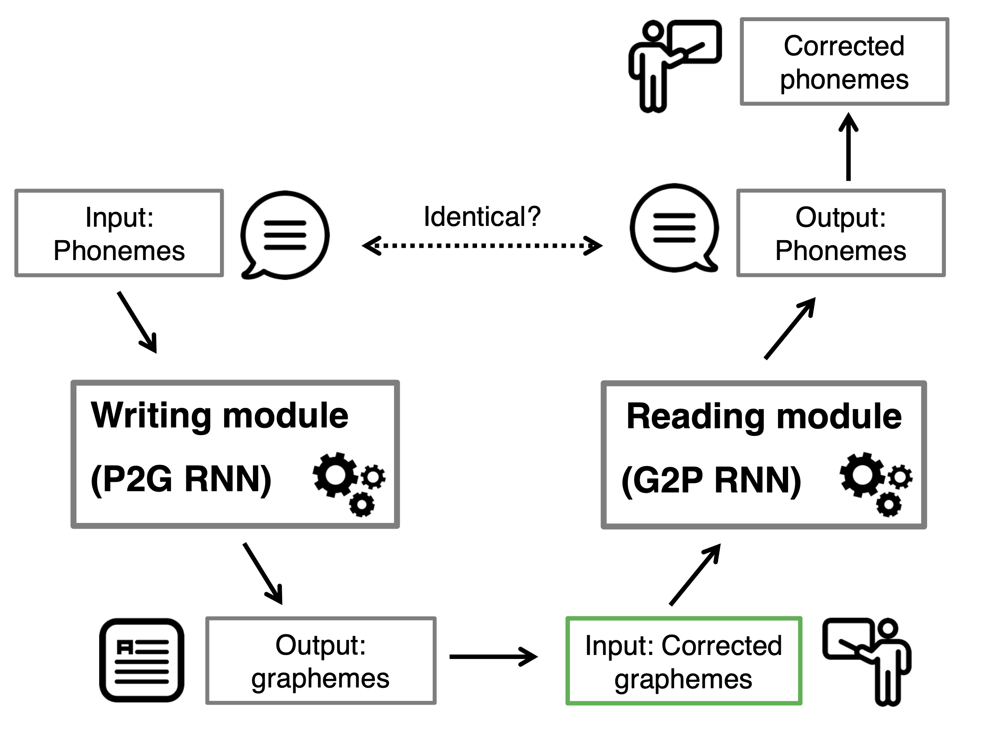

# Inventive spelling
Public repository with code for a computational investigation of the teaching method "inventive spelling". This is a teaching method used in reading and writing skill acquisition in primary schools.
In germanophone countries, this method is known as the **Reichen-method** or simply as **Lesen durch Schreiben**.

## Computational model
We propose a computational model based on two recurrent neural networks that allows to imitiate certain aspects of the inventive spelling.
<p align="center">
	
	<br>
   <em>Overview of computational model for reading and writing acquisition based on inventive spelling.</em>
</p>


### Installation

Set up a new `conda` env:
```
conda create --name invspell python=3.6
```

Install the requirements and the package in editable mode:
```sh
pip install -r requirements.txt
pip install -e .
```

### Model training

For example, to train the model on the `childlex` data, run:
```py
python scripts/run.py --data_dir ${PWD}/data --epochs 250 --print_step 1 --task childlex \
--batch_size 2500 --save_model 125 --test_size 0.05 --learn_type normal --reading True \
--optimization Adam --dropout 0.5 
```

### Citation
If you use this code, please cite:

```bib
@article{born2022computational,
title = {A computational investigation of inventive spelling and the “Lesen durch Schreiben” method},
journal = {Computers and Education: Artificial Intelligence},
volume = {3},
pages = {100063},
year = {2022},
issn = {2666-920X},
doi = {https://doi.org/10.1016/j.caeai.2022.100063},
author = {Jannis Born and Nikola I. Nikolov and Anna Rosenkranz and Alfred Schabmann and Barbara Maria Schmidt},
}
```
